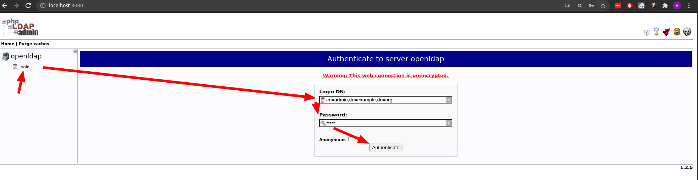
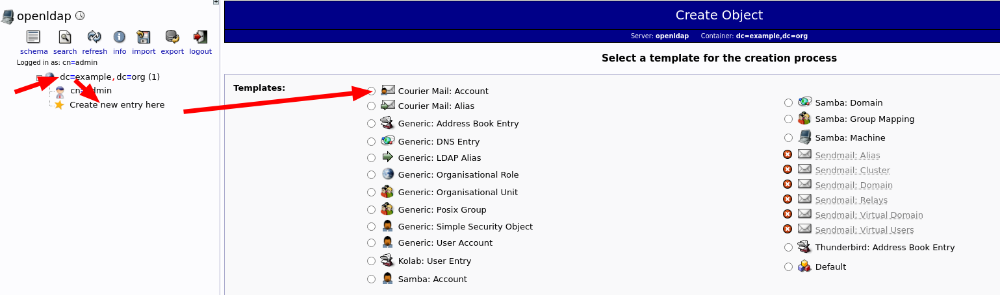
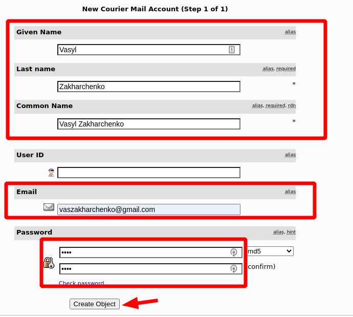
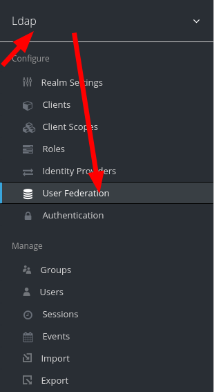
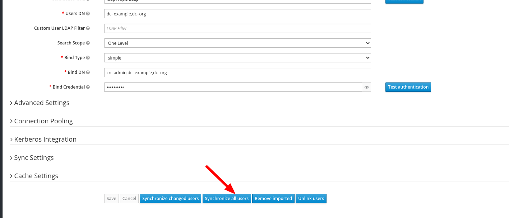
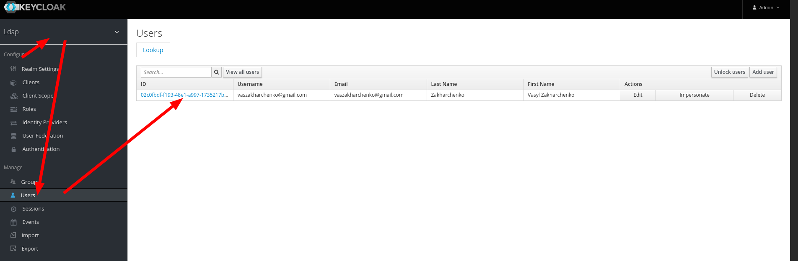
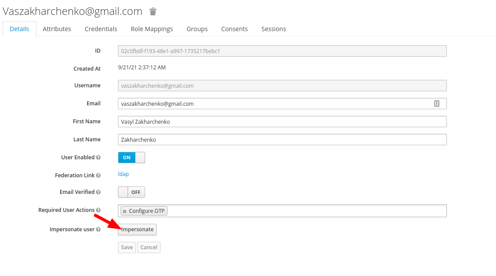

# LDAP Radius OTP Password Example (Google Authenticator)

# Build and Start
1. build and run keycloak, openldap and phpldapadmin
    ```
          docker-compose -f docker-compose.yaml up
    ```
2. add user account to openldap
    2.1 login http://localhost:8080/ with login: **cn=admin,dc=example,dc=org** and password=**admin** 
    2.2 add "Courier Mail: Account"  
3. open [http://localhost:8090/auth/]
4. login **admin**/**admin**
5. sync LDAP Users  
6. Configure OTP
 6.1 imporsonate user and logout   
 6.2 Click "Sign In"
7. install example
<pre>
cd Examples/LdapOtpExample
npm i
node server.js
</pre>
8. open [http://localhost:3001/](http://localhost:3001/)
9. type login **vaszakharchenko@gmail.com** password: **testOTP_Password** 
9. click the "connect To Radius Server"

"SUCCESS"


