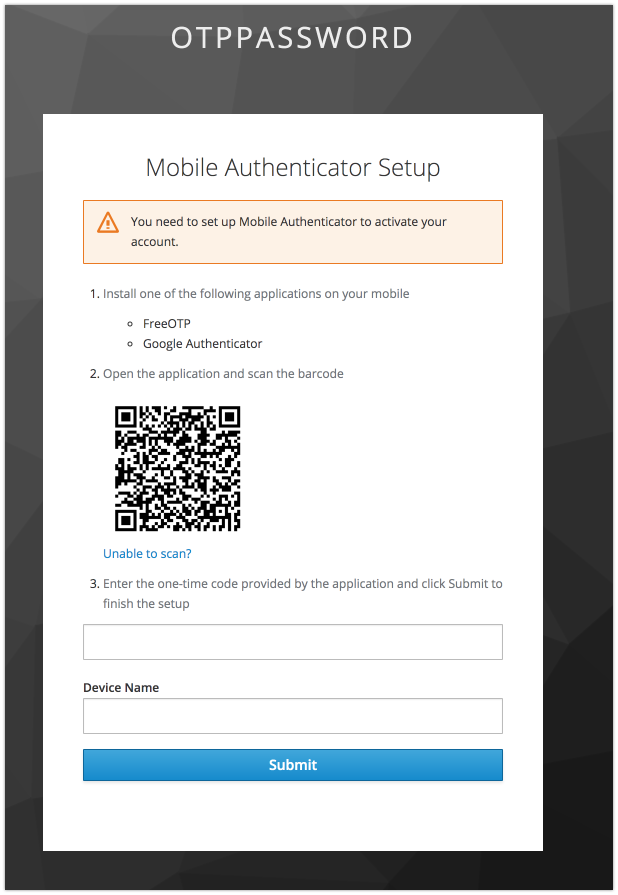
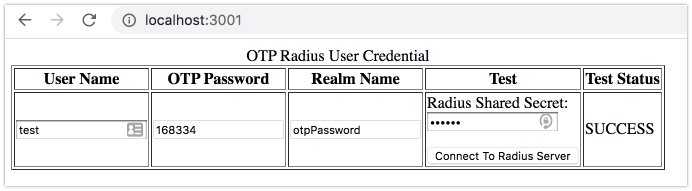

# Radius OTP Password Example (Google Authenticator)

Build and Start
1. build and run keycloak (docker https://github.com/vzakharchenko/keycloak-radius-plugin/tree/master/docker)
<pre>
- download and unzip keycloak-radius.zip (https://github.com/vzakharchenko/keycloak-radius-plugin/releases)
- unzip keycloak-radius.zip -d keycloak-radius
- cd keycloak-radius
- sh bin/standalone.sh  -c standalone.xml -b 0.0.0.0 -Djboss.bind.address.management=0.0.0.0 --debug 8190 -Djboss.http.port=8090
</pre>
2. open [http://localhost:8090/auth/]() and initialize master realm with login/password. 
3. open Administration Console
4. import realm from file [Realm.json](Realm.json) 
5. add User test/test for realm otpPassword 
6. imporsonate user and logout  
7. login to realm as user test and configure otp  
8. install example
<pre>
cd Examples/OTPPasswordJSExample
npm i
node server.js
</pre>
7. open [http://localhost:3001/](http://localhost:3001/)
8. type login test<OTP Password> and otp  
9. click the "connect To Radius Server"

"SUCCESS"

