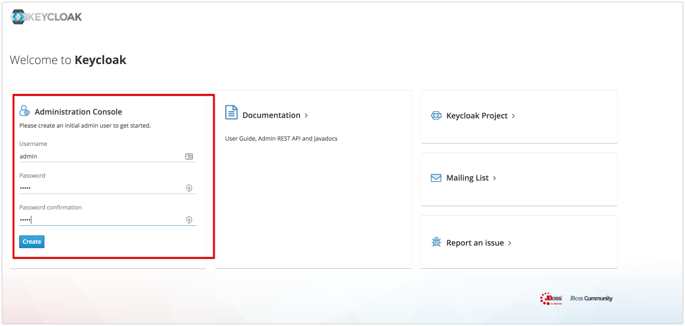

# Radius OneTime Password Example (OIDC)

Build and Start
1. build and run keycloak
<pre>
cd [keycloak](../../keycloak)
mvn clean install
cd target/
unzip keycloak-radius.zip -d keycloak-radius
cd keycloak-radius
sh bin/standalone.sh  -c standalone.xml -b 0.0.0.0 -Djboss.bind.address.management=0.0.0.0 --debug 8190 -Djboss.http.port=8090
</pre>
2. open [http://localhost:8090/auth/]() and initialize master realm with login/password. 
3. open Administration Console
4. import realm from file [Realm.json](Realm.json) 
5. add User test/test for realm oneTimePassword 
6. install example
<pre>
cd Examples/OneTimePasswordJSExample
npm i
node server.js
</pre>
7. open [http://localhost:3000/](http://localhost:3000/)
8. type login and password(test/test)
9. click the "connect To Radius Server" 
- Press Once - "SUCCESS"
- all other clicks - "REJECT"
- If you wait 5 mins -  "REJECT"

