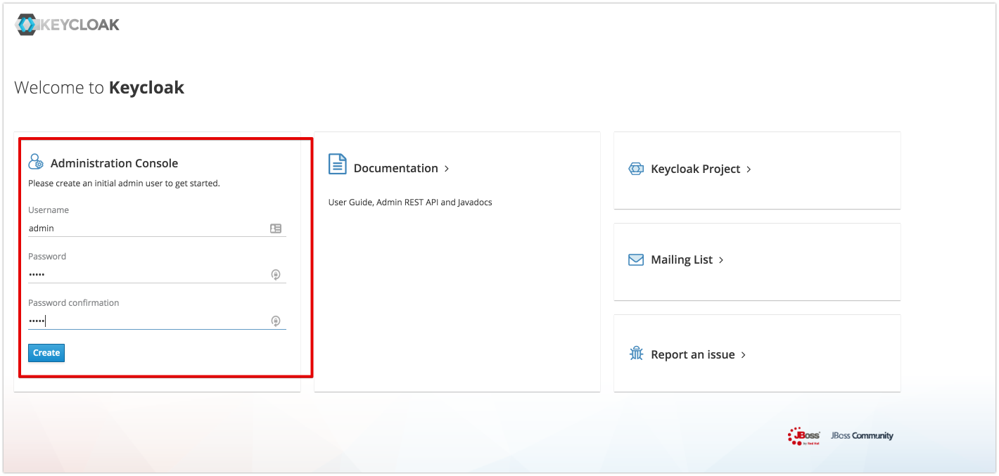
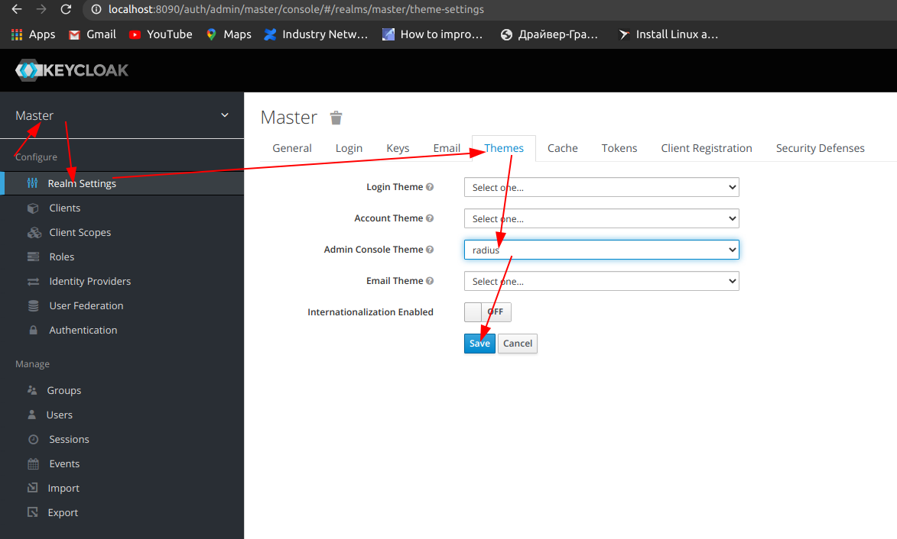
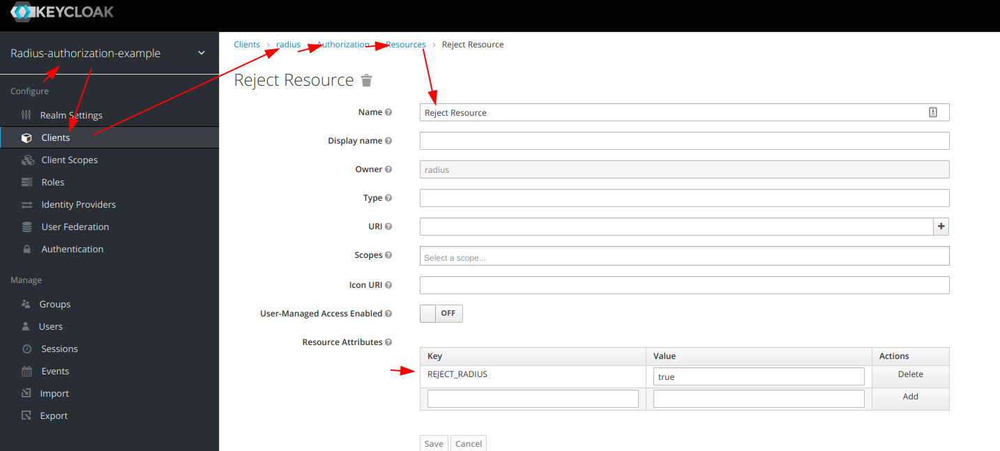
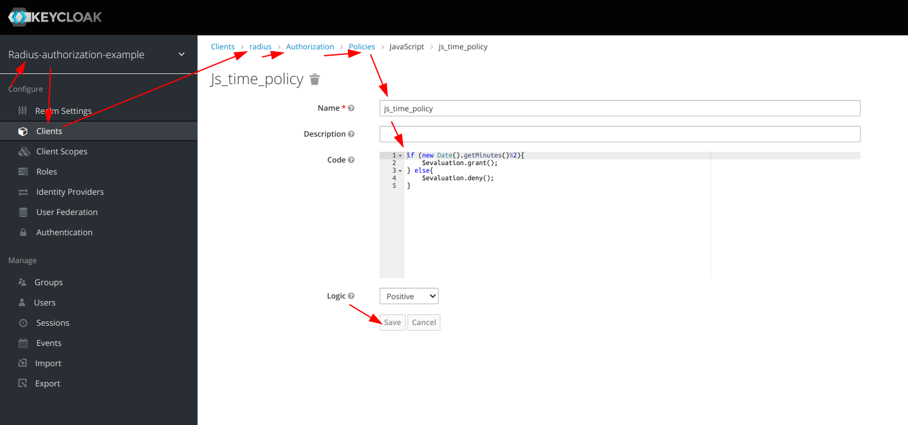
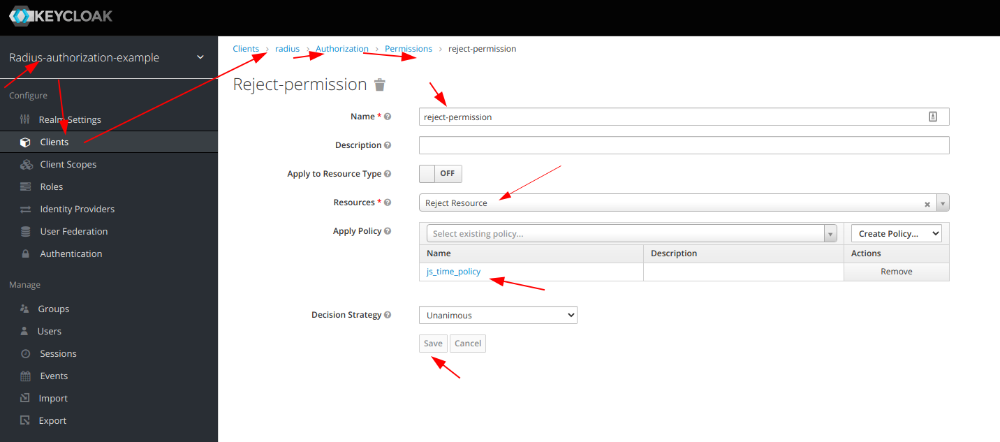

# Assign Attributes dynamically using javascript policy (https://www.keycloak.org/docs/latest/authorization_services/#_policy_js)

## Example Description
if the current minute is  divisible by 2 then assign attribute "REJECT_RADIUS" and reject access-request even with valid password
## Expected result
|     Current Minute    |     RESULT      |
|:----------------------|:----------------|
|            1          |     REJECT      |
|            2          |     ACCEPT      |
|            3          |     REJECT      |
|            ...        |        ...      |
|            15         |     REJECT      |
|            30         |     ACCEPT      |
|            ...        |        ...      |
|            58         |     ACCEPT      |
|            59         |     REJECT      |


# Build and Start
1. build and run keycloak
    1.1 [docker](../../docker)
    ```
      docker run -p 8090:8080 -p1812:1812/udp -p1813:1813/udp -e JAVA_OPTS="-Dkeycloak.profile.feature.scripts=enabled -Dkeycloak.profile.feature.upload_scripts=enabled -server -Xms64m -Xmx512m -XX:MetaspaceSize=96M -XX:MaxMetaspaceSize=256m -Djava.net.preferIPv4Stack=true -Djboss.modules.system.pkgs=org.jboss.byteman -Djava.awt.headless=true" -e KEYCLOAK_USER=admin -e KEYCLOAK_PASSWORD=admin  -v `pwd`/.:/example  -e KEYCLOAK_IMPORT=/example/authorization-realm.json  vassio/keycloak-radius-plugin
    ```
    1.2 release
        <pre>
        - download and unzip keycloak-radius.zip (https://github.com/vzakharchenko/keycloak-radius-plugin/releases)
        - unzip keycloak-radius.zip -d keycloak-radius
        - cd keycloak-radius
        - sh bin/standalone.sh   -Dkeycloak.profile.feature.upload_scripts=enabled  -c standalone.xml -b 0.0.0.0 -Djboss.bind.address.management=0.0.0.0 --debug 8190 -Djboss.http.port=8090
        </pre>
    1.3 Develop
    ```sh
    sudo apt-get install net-tools # Only once
    cd keycloak
    ./init.sh # Only once
    ./buildAndStart.sh
    ```
2. open [http://localhost:8090/auth/]() and initialize master realm with login/password. 
3. open Administration Console
4. **change admin theme to "radius"** [authorization-realm.json](authorization-realm.json) 
5. import realm from file [authorization-realm.json](authorization-realm.json) 

|     User    |     password    |
|:------------|:----------------|
| testuser    | testUser        |
| acceptUser  | acceptUser      |

|     RESOURCE     |  ATTRIBUTES           |                                                  |
|:-----------------|:----------------------|:-------------------------------------------------|
| Reject Resource  | REJECT_RADIUS = true  |  |

|     Policy       | Policy Type |                                              |
|:-----------------|:------------|:---------------------------------------------|
| js_time_policy   | JavaScript  |  |

**js_time_policy code**:
```javascript
if (new Date().getMinutes()%2){
    $evaluation.grant();
} else{
    $evaluation.deny();
}
```
|   Permission      | Resources        | Policy         |                                                       |
|:------------------|:-----------------|:---------------|:------------------------------------------------------|
| reject-permission | Reject Resource  | js_time_policy |   |


6. install example
<pre>
cd Examples/RadiusAuthorizationJSExample
npm i
npm run start
</pre>
7. open [http://localhost:3001/](http://localhost:3001/)
8. type login and password
9. click the "connect To Radius Server"

## Expected result
|     Current Minute    |     RESULT      |
|:----------------------|:----------------|
|            1          |     REJECT      |
|            2          |     ACCEPT      |
|            3          |     REJECT      |
|            ...        |        ...      |
|            15         |     REJECT      |
|            30         |     ACCEPT      |
|            ...        |        ...      |
|            58         |     ACCEPT      |
|            59         |     REJECT      |


