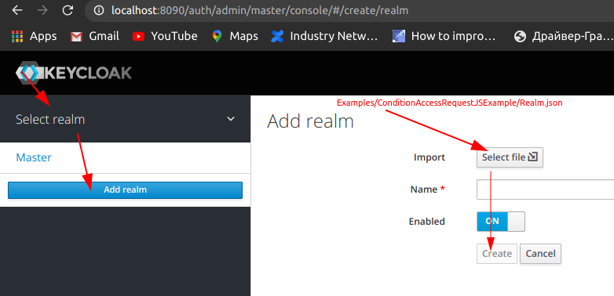

# Emulation of radius client which does not support the realm attribute

## Description
Emulation of radius client which does not support the realm attribute

## Build and Start
1. build and run keycloak (select installation)
    1.1 [docker installation](../../docker)
    ```
          docker run -p 8090:8080 -p1812:1812/udp -p1813:1813/udp -e JAVA_OPTS="-Dkeycloak.profile.feature.scripts=enabled -Dkeycloak.profile.feature.upload_scripts=enabled -server -Xms64m -Xmx512m -XX:MetaspaceSize=96M -XX:MaxMetaspaceSize=256m -Djava.net.preferIPv4Stack=true -Djboss.modules.system.pkgs=org.jboss.byteman -Djava.awt.headless=true" -e KEYCLOAK_ADMIN=admin -e KEYCLOAK_ADMIN_PASSWORD=admin  -v `pwd`/.:/example  -e KEYCLOAK_IMPORT=/example/Realm.json  vassio/keycloak-radius-plugin start-dev
    ```
    1.2 release installation
        <pre>
        - download and unzip keycloak-radius.zip (https://github.com/vzakharchenko/keycloak-radius-plugin/releases)
        - unzip keycloak-radius.zip -d keycloak-radius
        - cd keycloak-radius
        - sh bin/standalone.sh   -Dkeycloak.profile.feature.upload_scripts=enabled  -c standalone.xml -b 0.0.0.0 -Djboss.bind.address.management=0.0.0.0 --debug 8190 -Djboss.http.port=8090
        </pre>
    1.3 Develop  installation
    ```sh
    sudo apt-get install net-tools # Only once
    cd keycloak
    ./init.sh # Only once
    ./buildAndStart.sh
    ```
2. open [http://localhost:8090/auth/]() and initialize master realm with login/password. 
3. open Administration Console
4. import realm from file [Realm.json](Realm.json) 

|     User    |     password    |
|:------------|:----------------|
| testUser    | testUser        |

5. install example
<pre>
cd Examples/RadiusDefaultRealmJSExample
npm i
npm run start
</pre>
6. open [http://localhost:3001/](http://localhost:3001/)
7. type login and password
8. click the "connect To Radius Server"


