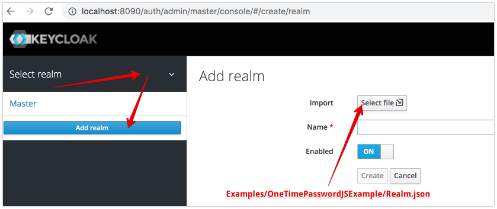
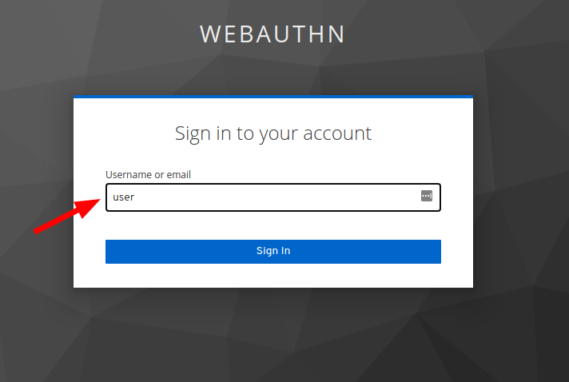
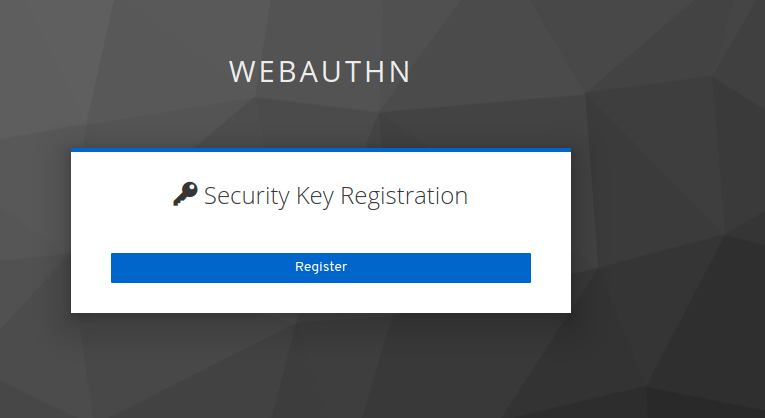
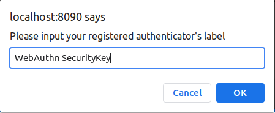

# WebAuthn Authorization Example (Passwordless login)
 - authorize to radius using fingerprint or fido u2f, FIDO2 (yubikey or analogs).
 - Password sync with access token(if token expired then password also expired)
 - during refresh token, session password will be updated.

# Build and Start
1. build and run keycloak (select one of installation)
    1.1 [docker installation](../../docker)
    ```
          docker run -p 8090:8080 -p1812:1812/udp -p1813:1813/udp -e JAVA_OPTS="-Dkeycloak.profile.feature.scripts=enabled -Dkeycloak.profile.feature.upload_scripts=enabled -server -Xms64m -Xmx512m -XX:MetaspaceSize=96M -XX:MaxMetaspaceSize=256m -Djava.net.preferIPv4Stack=true -Djboss.modules.system.pkgs=org.jboss.byteman -Djava.awt.headless=true" -e KEYCLOAK_USER=admin -e KEYCLOAK_PASSWORD=admin  -v `pwd`/.:/example  -e KEYCLOAK_IMPORT=/example/realm.json  vassio/keycloak-radius-plugin
    ```
    1.2 release installation
        <pre>
        - download and unzip keycloak-radius.zip (https://github.com/vzakharchenko/keycloak-radius-plugin/releases)
        - unzip keycloak-radius.zip -d keycloak-radius
        - cd keycloak-radius
        - sh bin/standalone.sh   -Dkeycloak.profile.feature.upload_scripts=enabled  -c standalone.xml -b 0.0.0.0 -Djboss.bind.address.management=0.0.0.0 --debug 8190 -Djboss.http.port=8090
        </pre>
    1.3 Develop  installation
    ```sh
    sudo apt-get install net-tools # Only once
    cd keycloak
    ./init.sh # Only once
    ./buildAndStart.sh
    ```
2. open [http://localhost:8090/auth/]() and initialize master realm with login/password. 
3. open Administration Console
4. import realm from file [realm.json](./realm.json) 
6. install example
<pre>
cd Examples/WebAuthnJSExample
npm i
node server.js
</pre>
7. open [http://localhost:3000/](http://localhost:3000/)
8. type username(user) 
9. register your fingerprint or security key (Yubikey or analogs)
 
 
10. click the "connect To Radius Server" 


