# Embedded Radius Server in [Keycloak](https://www.keycloak.org/) SSO
[](https://circleci.com/gh/vzakharchenko/keycloak-radius-plugin/tree/master)


[](https://coveralls.io/github/vzakharchenko/keycloak-radius-plugin?branch=master)
[]
<a href="https://codeclimate.com/github/vzakharchenko/keycloak-radius-plugin/maintainability"></a>

Run radius server inside [keycloak](https://www.keycloak.org/).
features:
- Embedded radius server in [keycloak](https://www.keycloak.org/)
- use keycloak authentication and authorization for the embedded RADIUS server
- [radius oidc password](Examples/OneTimePasswordJSExample)
- [webAuthn authentication. Radius Authentication using your fingerprint or FIDO2 security key](Examples/WebAuthnJSExample)
- [radius OTP password (TOTP/HOTP via Google Authenticator or FreeOTP)](#otp-password)
- use [Keycloak user credentials, if radius access-request protocol is PAP](#mapping-radius-password-to-keycloak-credentials) Otherwise is using [Keycloak Radius credentials](#keycloak-radius-credentials) or OTP
- [use Kerberos/ldap credentials(only if Radius client use PAP authorization)](#mapping-radius-password-to-keycloak-credentials)
- can work as [radius proxy](#radius-proxy)
- support [Radsec Protocol](keycloak-plugins/rad-sec-plugin/README.md#radsec-example) (Radius over TLS)
- Map Keycloak [authorization](#assign-radius-attributes-to-authorization-resource) ,  [Role](#assign-radius-attributes-to-role), [Group](#assign-radius-attributes-to-group) and [User](#assign-radius-attributes-to-user) Attributes to Radius Attributes
- conditional attributes for authorization/Role/Group/User
- reject attribute for authorization/Role/Group/User
- dynamically assign attributes based on keycloak policies(Role, [javascript](Examples/RadiusAuthorizationJSExample), Time, User)
- start/stop Keycloak Session 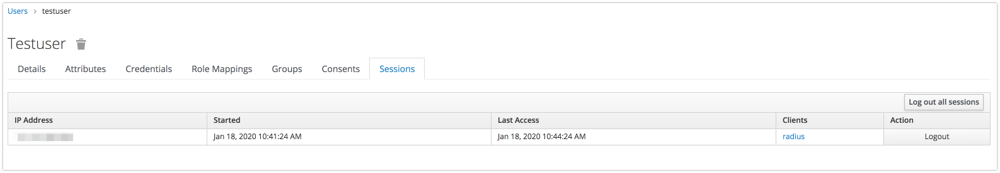
- BackChannel logout(Disconnect-message request)
- Service to Service communication
- [Mikrotik plugin](keycloak-plugins/mikrotik-radius-plugin)
- [Cisco plugin](keycloak-plugins/cisco-radius-plugin) (thanks [vbkunin](https://github.com/vbkunin))
- [Chillispot plugin](keycloak-plugins/chillispot-radius-plugin)
- [Social Hotspot Login](https://github.com/vzakharchenko/mikrotik-hotspot-oauth)
- [PPTP VPN with Radsec](https://github.com/vzakharchenko/pptp-radius-docker)
- [L2TP IPSec VPN with Radius and Radsec](https://github.com/vzakharchenko/l2tp-ipsec-radius-docker)
- Specify Realm in username: username@realm
- support docker arm64 and arm/v7

## Examples
 - [Assign attributes dynamically using javascript policy](Examples/RadiusAuthorizationJSExample)
 - [Reject and Accept by condition example](Examples/ConditionAccessRequestJSExample)
 - [Radius and OIDC integration example](Examples/OneTimePasswordJSExample)
 - [OTP Password example](Examples/OTPPasswordJSExample)
 - [Ldap Password with OTP example](Examples/LdapOtpExample)
 - [Default Realm example(if the radius client does not support realm attribute)](Examples/RadiusDefaultRealmJSExample)
 - [An example of a call from  backend service to radius using a service account (Service to Service communication)](Examples/RadiusServiceAccountJSExample)
 - [WebAuthn authentication. Radius Authentication using your fingerprint or FIDO2 security key](Examples/WebAuthnJSExample)

## Donate
<a href="https://secure.wayforpay.com/button/bf1e79d05af0c" style="display:inline-block!important;background:#2B3160 url('https://s3.eu-central-1.amazonaws.com/w4p-merch/button/bg6x2.png') no-repeat center right;background-size:cover;width: 256px!important;height:54px!important;border:none!important;border-radius:14px!important;padding:18px!important;text-decoration:none!important;box-shadow:3px 2px 8px rgba(71,66,66,0.22)!important;text-align:left!important;box-sizing:border-box!important;" onmouseover="this.style.opacity='0.8';" onmouseout="this.style.opacity='1';"><span style="font-family:Verdana,Arial,sans-serif!important;font-weight:bold!important;font-size:14px!important;color:#ffffff!important;line-height:18px!important;vertical-align:middle!important;">Donate</span></a>

## Release Setup
1. Download  keycloak-radius.zip asset from [github releases](https://github.com/vzakharchenko/keycloak-radius-plugin/releases)
2. unzip release <pre><code>unzip keycloak-radius.zip -d keycloak-radius</pre></code>
3. run keycloak  <pre><code>sh keycloak-radius/bin/standalone.sh  -c standalone.xml -b 0.0.0.0 -Djboss.bind.address.management=0.0.0.0 --debug 8190 -Djboss.http.port=8090</pre></code>
4. open http://localhost:8090
5. initialize keycloak master realm
## Docker Container
[Run inside Docker Container](docker/README.md)
## Manual Setup
### build project
***requirements***: java jdk 17 and above, maven 3.5 and above
 - ```cd keycloak-plugins```
 - ```mvn clean install```
### Configure Keycloak (based on Quarkus)
***requirements***: [keycloak 24.0.4](https://github.com/keycloak/keycloak/releases/download/24.0.4/keycloak-24.0.4.zip)
```bash
cp ${SOURCE}/keycloak-plugins/radius-plugin/target/radius-plugin-*.jar \
   ${SOURCE}/keycloak-plugins/rad-sec-plugin/target/rad-sec-plugin-*.jar \
   ${SOURCE}/keycloak-plugins/mikrotik-radius-plugin/target/mikrotik-radius-plugin-*.jar \
   ${SOURCE}/keycloak-plugins/cisco-radius-plugin/target/cisco-radius-plugin-*.jar \
   ${SOURCE}/keycloak-plugins/chillispot-radius-plugin/target/chillispot-radius-plugin-*.jar \
   ${SOURCE}/keycloak-plugins/radius-disconnect-plugin/target/radius-disconnect-plugin-*.jar \
   ${SOURCE}/keycloak-plugins/proxy-radius-plugin/target/proxy-radius-plugin-*.jar \
   ${SOURCE}/keycloak-radius-plugin/keycloak-plugins/radius-theme/target/radius-theme-*.zip \
     ${KEYCLOAK_PATH}/providers/
```
where
- **KEYCLOAK_PATH** - Path where you are unpacked keycloak-24.0.4.zip [(you can use RADIUS_CONFIG_PATH instead of KEYCLOAK_PATH)](#environment-variables)
- **SOURCE** - Path where you checked out the code and built the project

### Environment Variables

| Variable Name      | Variable Value                         | Config file Location                         |
|--------------------|----------------------------------------|----------------------------------------------|
| KEYCLOAK_PATH      | Path where you are unpacked keycloak   | ${KEYCLOAK_PATH}/config/radius.config        |
| RADIUS_CONFIG_PATH | Path where you store radius.config     | ${RADIUS_CONFIG_PATH}/radius.config          |

Examples:
```
export RADIUS_CONFIG_PATH= /opt/keycloak/radius/config
```
or
```
export KEYCLOAK_PATH= /opt/keycloak/
```

## Configuration
### Radius server config file
-  create file ${KEYCLOAK_PATH}config/radius.config or ${RADIUS_CONFIG_PATH}/radius.config
-  example <pre><code>{
  "sharedSecret": "radsec",
  "authPort": 1812,
  "accountPort": 1813,
  "numberThreads": 8,
  "useUdpRadius": true,
  "externalDictionary": "/opt/dictionary",
  "otpWithoutPassword": [ ],
  "radsec": {
    "privateKey": "config/private.key",
    "certificate": "config/public.crt",
    "numberThreads": 8,
    "useRadSec": true
  },
   "coa":{
      "port":3799,
      "useCoA":true
   }
}
</code></pre>

where
   -  **sharedSecret** - Used to secure communication between a RADIUS server and a RADIUS client.
   -  **authPort** - Authentication and authorization port
   -  **accountPort** - Accounting port
   -  **useUdpRadius** - if true, then listen to authPort and accountPort
   -  **radsec** - radsec configuration
   -  **privateKey** - private SSL key (https://netty.io/wiki/sslcontextbuilder-and-private-key.html)
   -  **certificate** - certificates chain
   -  **useRadSec** - if true, then listen  radsec port
   -  **numberThreads** - number of connection threads
   -  **coa** - CoA request configuration
   -  **port** - CoA port (Mikrotik:3799, Cisco:1700)
   -  **useCoA** - use CoA request
   -  **otpWithoutPassword** - allow _OTP without password_ for the supplied protocols (CHAP, MSCHAPV2, PAP),
      e.g. ```"otpWithoutPassword": [ "chap", "mschapv2", "pap" ]```
   - **otp** - _deprecated_, ignored if **otpWithoutPassword** is defined, otherwise
     ```"otp":true``` is interpreted for backward compatibility as ```"otpWithoutPassword": [ "chap", "mschapv2" ]```
   -  **externalDictionary** - path to the dictionary file in freeradius format
##
 Run Keycloak Locally
```bash
#!/usr/bin/env bash
set -e
cd keycloak-24.0.4
sh bin/kc.sh --debug 8190 start-dev --http-port=8090
```

### Keycloak Client with Radius Protocol
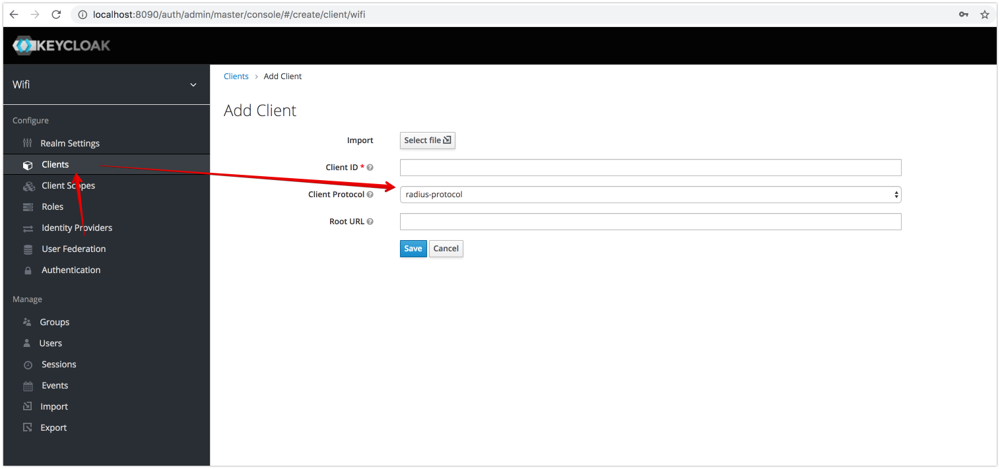

### Mapping Radius Password to Keycloak Credentials

| Radius Protocol | Keycloak credentials | Keycloak credentials with OTP | Kerberos credentials | LDAP credentials | [Keycloak Radius credentials](#keycloak-radius-credentials) | [Keycloak Radius credentials](#keycloak-radius-credentials) with OTP | Keycloak OTP without password |
|-----------------|----------------------|-------------------------------|----------------------|------------------|-----------------------------|--------------------------------------|-------------------------------|
| PAP             | Yes                  | Yes                           | Yes                  | Yes              | Yes                         | Yes                                  | Yes *1                        |
| CHAP            | No                   | No                            | No                   | No               | Yes                         | Yes                                  | Yes                           |
| MSCHAPV2        | No                   | No                            | No                   | No               | Yes                         | Yes                                  | Yes                           |

*1) In contrast to CHAP and MSCHAPV2, an OTP token must be registered with the account for 
PAP and _OTP without a password_.
This prevents authentication from being successful with the password only, even if the user does not yet have a token.
An OTP token code is always required as a second factor (password plus code or code without password).


### Assign Radius Attributes to Role
> **_NOTE:_**  Composite roles supported

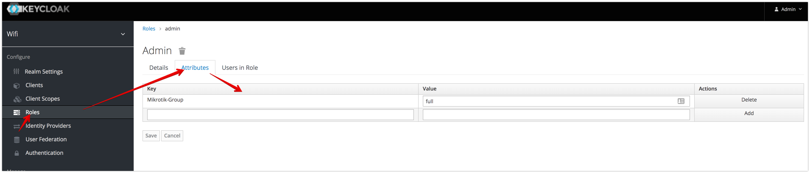
#### Role Conditional Attributes
if conditional Attribute is present and has valid value then all other attributes will be applied.
(Example: apply role attributes only if NAS-IP-Address= 192.168.88.1)

**Structure of Attribute:** <pre>\<PREFIX\>\<ATTRIBUTE_NAME\>=\<values\></pre>

- **PREFIX** = <pre>COND_</pre>
- **ATTRIBUTE_NAME** attribute name from access-request
- **VALUES** Comma-separated list of attribute values

Example:
<pre>COND_NAS-IP-Address = "192.168.88.1, 192.168.88.2"</pre>
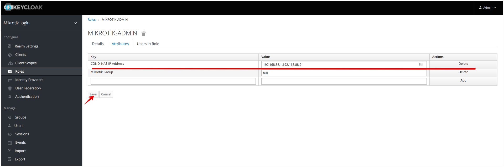
The role will only be applied if the NAS server address is 192.168.88.1 or 192.168.88.2.
#### Role REJECT Attributes ([Example](Examples/ConditionAccessRequestJSExample))
if reject Attribute is present and has valid value then access request will be rejected.
(Example: reject user request if access request contains attribute NAS-IP-Address= 192.168.88.1)

**Structure of Attribute:** <pre>\<PREFIX\>\<ATTRIBUTE_NAME\>=\<values\></pre>

- **PREFIX** = <pre>REJECT_</pre>
- **ATTRIBUTE_NAME** attribute name from access-request
- **VALUES** Comma-separated list of attribute values

Example:
<pre>REJECT_NAS-IP-Address = "192.168.88.2"</pre>
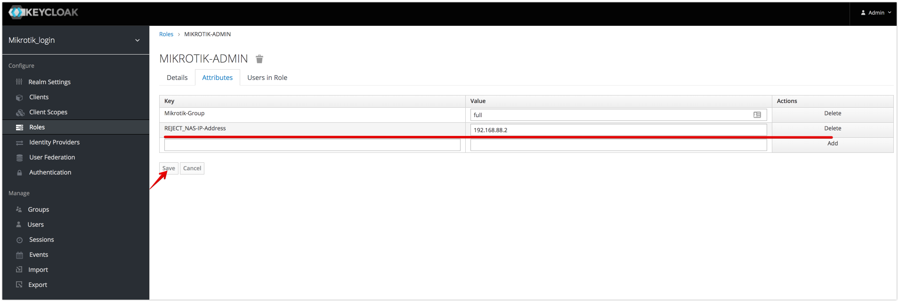
The role will only be applied if the NAS server address is not 192.168.88.2, otherwise request will be rejected

#### Role REJECT WITHOUT CONDITION
If Reject Attribute is present then access request will be rejected.
**Structure of Attribute:** ```REJECT_RADIUS=<ANY VALUE>```
Example:
<pre>REJECT_RADIUS = "true"</pre>

#### Role ACCEPT Attributes ([Example](Examples/ConditionAccessRequestJSExample))
if accept Attribute is present and has valid value then access request will be accepted, otherwise rejected.
(Example: accept user request if access request contains attribute NAS-IP-Address= 192.168.88.1,192.168.88.2)

**Structure of Attribute:** <pre>\<PREFIX\>\<ATTRIBUTE_NAME\>=\<values\></pre>

- **PREFIX** = <pre>ACCEPT_</pre>
- **ATTRIBUTE_NAME** attribute name from access-request
- **VALUES** Comma-separated list of attribute values

Example:
<pre>ACCEPT_NAS-IP-Address = "192.168.88.1"</pre>

The role will only be applied if the NAS server address is not 192.168.88.2, otherwise request will be rejected

### Assign Radius Attributes to Group
> **_NOTE:_**  SubGroups supported
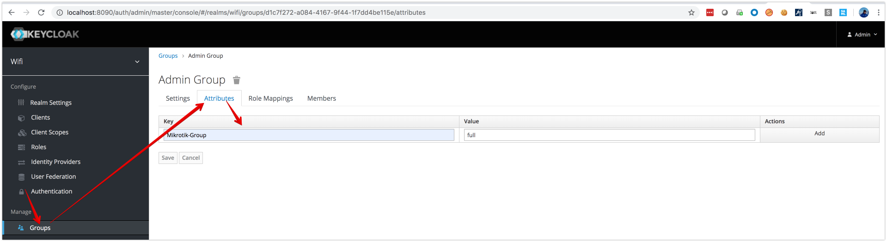
#### Group Conditional Attributes
if conditional Attribute is present and has valid value then all other attributes will be applied.
(Example: apply group attributes only if NAS-IP-Address= 192.168.88.1)

**Structure of Attribute:** <pre>\<PREFIX\>\<ATTRIBUTE_NAME\>=\<values\></pre>

- **PREFIX** = <pre>COND_</pre>
- **ATTRIBUTE_NAME** attribute name from access-request
- **VALUES** Comma-separated list of attribute values

Example:
[Role Conditional Attributes](#role-conditional-attributes)/README.md:1
#### Group REJECT Attributes
if reject Attribute is present and has valid value then access request will be rejected.
(Example: reject user request if access request contains attribute NAS-IP-Address= 192.168.88.1)

**Structure of Attribute:** <pre>\<PREFIX\>\<ATTRIBUTE_NAME\>=\<values\></pre>

- **PREFIX** = <pre>REJECT_</pre>
- **ATTRIBUTE_NAME** attribute name from access-request
- **VALUES** Comma-separated list of attribute values

Example:
[Role REJECT Attributes](#role-reject-attributes)


#### Group REJECT WITHOUT CONDITION
If Reject Attribute is present then access request will be rejected.
**Structure of Attribute:** ```REJECT_RADIUS=<ANY VALUE>```
Example:
<pre>REJECT_RADIUS = "true"</pre>

#### Group ACCEPT Attributes
if accept Attribute is present and has valid value then access request will be accepted, otherwise rejected.
(Example: accept user request if access request contains attribute NAS-IP-Address= 192.168.88.1,192.168.88.2)

**Structure of Attribute:** <pre>\<PREFIX\>\<ATTRIBUTE_NAME\>=\<values\></pre>

- **PREFIX** = <pre>ACCEPT_</pre>
- **ATTRIBUTE_NAME** attribute name from access-request
- **VALUES** Comma-separated list of attribute values

Example:
[Role ACCEPT Attributes](#role-accept-attributes)
### Assign Radius Attributes to User
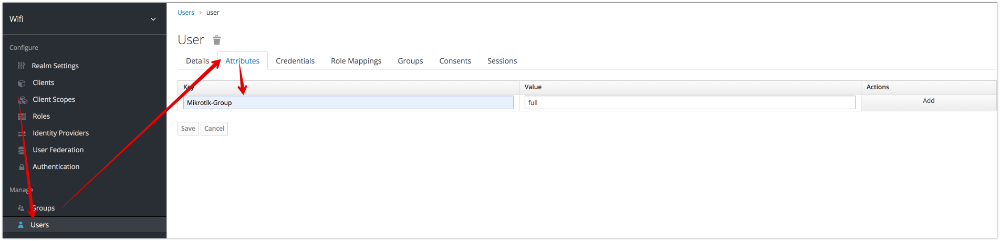
#### User Conditional Attributes
if conditional Attribute is present and has valid value then all other attributes will be applied.
(Example: apply user attributes only if NAS-IP-Address= 192.168.88.1)

**Structure of Attribute:** <pre>\<PREFIX\>\<ATTRIBUTE_NAME\>=\<values\></pre>

- **PREFIX** = <pre>COND_</pre>
- **ATTRIBUTE_NAME** attribute name from access-request
- **VALUES** Comma-separated list of attribute values

Example:
[Role Conditional Attributes](#role-conditional-attributes)/README.md:1
#### User REJECT Attributes
if reject Attribute is present and has valid value then access request will be rejected.
(Example: reject user request if access request contains attribute NAS-IP-Address= 192.168.88.1)

**Structure of Attribute:** <pre>\<PREFIX\>\<ATTRIBUTE_NAME\>=\<values\></pre>

- **PREFIX** = <pre>REJECT_</pre>
- **ATTRIBUTE_NAME** attribute name from access-request
- **VALUES** Comma-separated list of attribute values

Example:
[Role REJECT Attributes](#role-reject-attributes)
#### User ACCEPT Attributes
if accept Attribute is present and has valid value then access request will be accepted, otherwise rejected.
(Example: accept user request if access request contains attribute NAS-IP-Address= 192.168.88.1,192.168.88.2)

**Structure of Attribute:** <pre>\<PREFIX\>\<ATTRIBUTE_NAME\>=\<values\></pre>

- **PREFIX** = <pre>ACCEPT_</pre>
- **ATTRIBUTE_NAME** attribute name from access-request
- **VALUES** Comma-separated list of attribute values

Example:
[Role ACCEPT Attributes](#role-accept-attributes)

### Assign Radius Attributes to Authorization Resource
#### Change admin theme to "Radius"
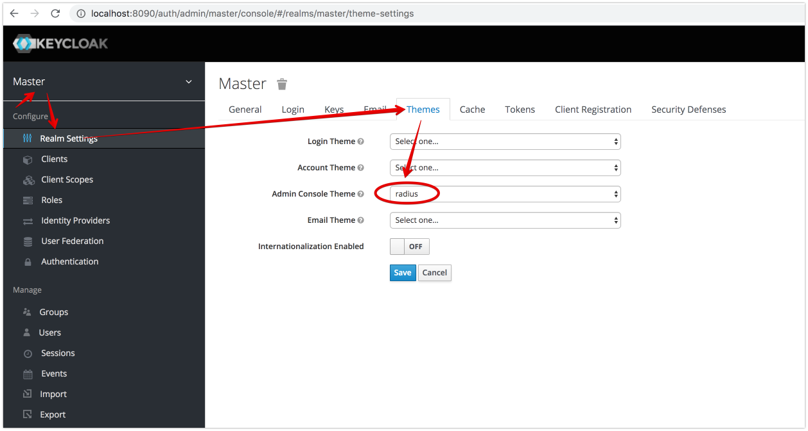
#### Enable Authorization on Radius Client
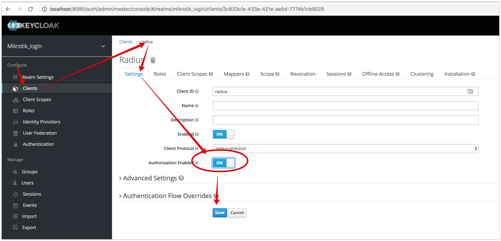
#### [Create Resource](https://www.keycloak.org/docs/latest/authorization_services/#_resource_overview)
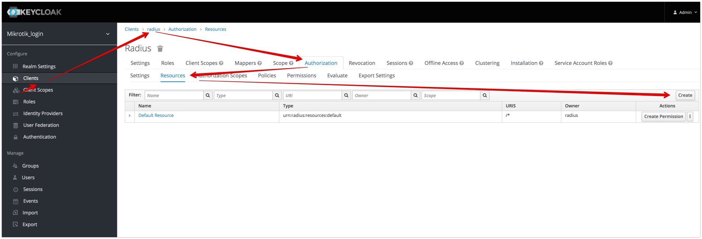
#### [Assign Attributes to Resource](https://www.keycloak.org/docs/latest/authorization_services/#resource-attributes)
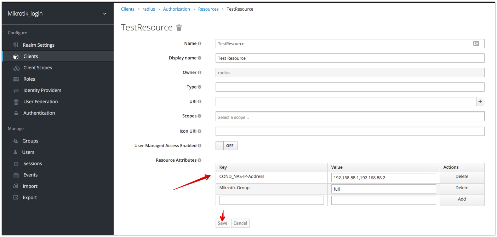
#### Create policy and permissions
- [authorization policies](https://www.keycloak.org/docs/latest/authorization_services/#_policy_overview)
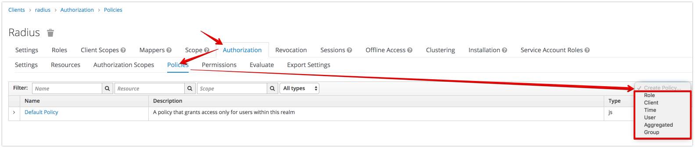
- [authorization permissions](https://www.keycloak.org/docs/latest/authorization_services/#_permission_overview)
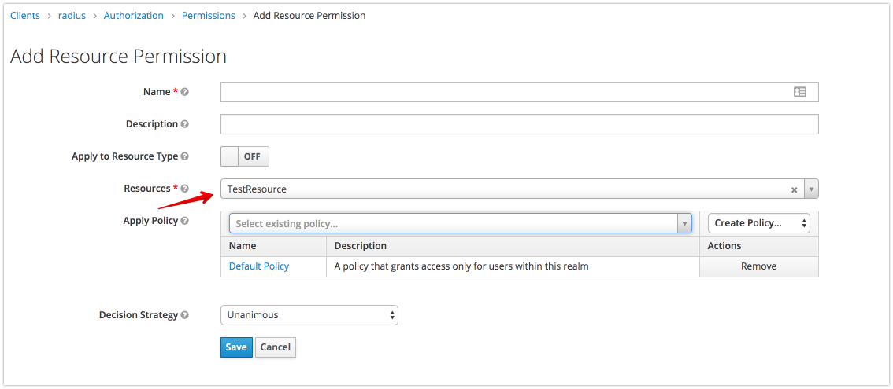
#### Resource Conditional Attributes
if conditional Attribute is present and has valid value then all other attributes will be applied.
(Example: apply user attributes only if NAS-IP-Address= 192.168.88.1)

**Structure of Attribute:** <pre>\<PREFIX\>\<ATTRIBUTE_NAME\>=\<values\></pre>

- **PREFIX** = <pre>COND_</pre>
- **ATTRIBUTE_NAME** attribute name from access-request
- **VALUES** Comma-separated list of attribute values

Example:
[Role Conditional Attributes](#role-conditional-attributes)/README.md:1
#### Resource REJECT Attributes
if reject Attribute is present and has valid value then access request will be rejected.
(Example: reject user request if access request contains attribute NAS-IP-Address= 192.168.88.1)

**Structure of Attribute:** <pre>\<PREFIX\>\<ATTRIBUTE_NAME\>=\<values\></pre>

- **PREFIX** = <pre>REJECT_</pre>
- **ATTRIBUTE_NAME** attribute name from access-request
- **VALUES** Comma-separated list of attribute values

Example:
[Role REJECT Attributes](#role-reject-attributes-example)
#### Resource REJECT without condition
If Reject Attribute is present then access request will be rejected.
**Structure of Attribute:** ```REJECT_RADIUS=<ANY VALUE>```
Example:
<pre>REJECT_RADIUS = "true"</pre>

#### Resource ACCEPT Attributes
if accept Attribute is present and has valid value then access request will be accepted, otherwise rejected.
(Example: accept user request if access request contains attribute NAS-IP-Address= 192.168.88.1,192.168.88.2)

**Structure of Attribute:** <pre>\<PREFIX\>\<ATTRIBUTE_NAME\>=\<values\></pre>

- **PREFIX** = <pre>ACCEPT_</pre>
- **ATTRIBUTE_NAME** attribute name from access-request
- **VALUES** Comma-separated list of attribute values

Example:
[Role ACCEPT Attributes](#role-accept-attributes-example)


###  Hotspot Example (with Facebook login)

[Hotspot Example (with Facebook login)](hotspot)

### Example CoA Configuration
[Radius Disconnect Message](keycloak-plugins/radius-disconnect-plugin)

### Radius Proxy

[Radius Proxy Module](keycloak-plugins/proxy-radius-plugin)

### Keycloak Radius credentials
 - Setup Radius Credentials during first time login
     1. set Action "Update Radius Password" (or send this event to user be email) 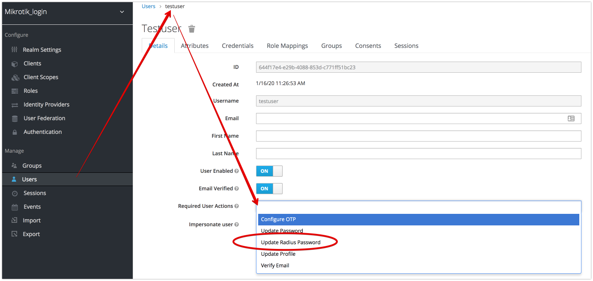
     2. User sets his own Radius password 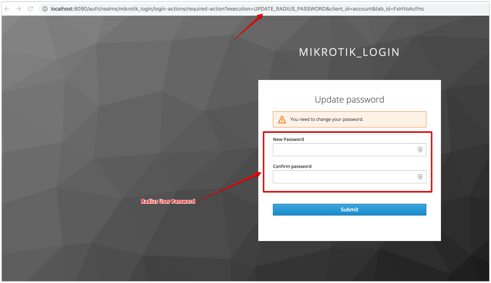


### OTP Password

1. enable OTP Password on Keycloak side. https://www.keycloak.org/docs/latest/server_admin/
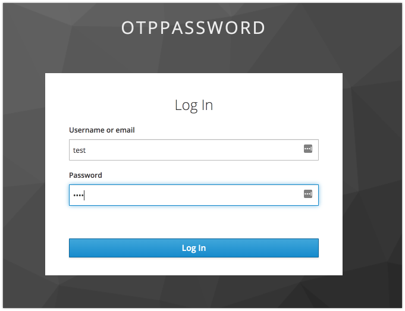 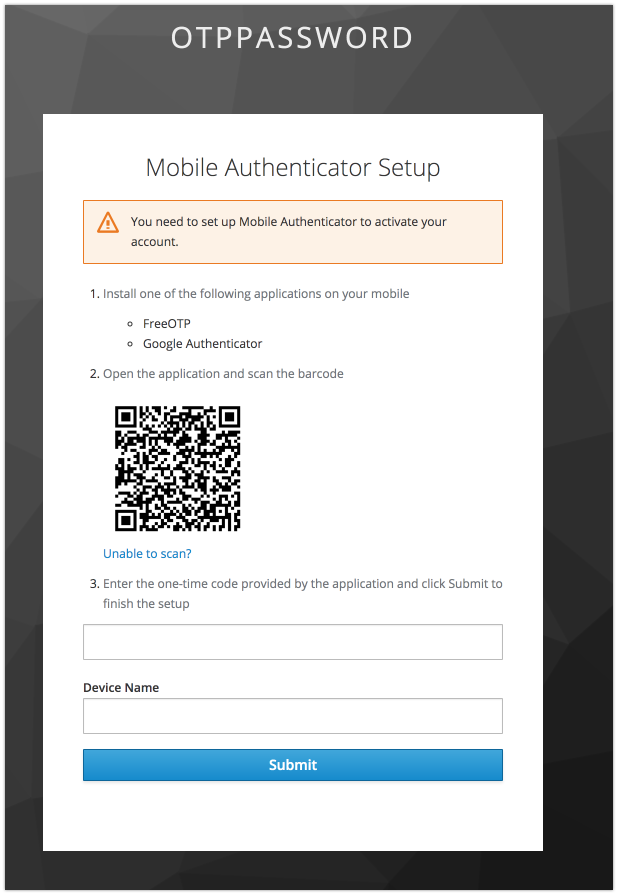
2. password in request must contain the password concatenated with OTP token code .
3. Structure Password in request:
    -  PAP password: ```<Keycloak Password/RADIUS Password><OTP>```,
       example: testPassword123456, where testPassword is password, 123456 is OTP
    -  MSCHAPV2/CHAP: ```<RADIUS Password><OTP>```,
       example: testPassword123456, where testPassword is password, 123456 is OTP
    -  PAP password with _OTP without password_ (if config file contains
       ```"otpWithoutPassword": [ "pap", ... ]```): ```<OTP>``` or ```<RADIUS Password/Keycloak Password/RADIUS Password><OTP>```,
       example: 123456, where 123456 is OTP
   -  MSCHAPV2/CHAP password with _OTP without password_ (if config file contains
      ```"otpWithoutPassword": [ "chap", "mschapv2", ... ]```): ```<OTP>``` or ```<RADIUS Password><OTP>``` or ```<RADIUS Password>``` if no OTP token is registered,
      example: 123456, where 123456 is OTP

[OTP Password example](Examples/OTPPasswordJSExample)

### WebAuthn Authentication
[wiki page](https://github.com/vzakharchenko/keycloak-radius-plugin/wiki/WebAuthnRadius)

## Add custom Radius Dictionary (example for Fortinet)
 - create dictionary Fortinet.dictionary:
```
VENDOR		12356   Fortinet

VENDORATTR	12356 Fortinet-Group-Name			1	string
VENDORATTR	12356 Fortinet-Client-IP-Address		2	ipaddr
VENDORATTR	12356 Fortinet-Vdom-Name			3	string
VENDORATTR	12356 Fortinet-Client-IPv6-Address		4	octets
VENDORATTR	12356 Fortinet-Interface-Name			5	string
VENDORATTR	12356 Fortinet-Access-Profile			6	string
```
 - run as docker container
```
  docker run -p 8090:8080 -e  -server -Xms64m -Xmx512m -XX:MetaspaceSize=96M -XX:MaxMetaspaceSize=256m -Djava.net.preferIPv4Stack=true -Djboss.modules.system.pkgs=org.jboss.byteman -Djava.awt.headless=true" -e KEYCLOAK_ADMIN=admin -e KEYCLOAK_ADMIN_PASSWORD=admin -e RADIUS_DICTIONARY=/opt/dictionary -v `pwd`/Fortinet.dictionary:/opt/dictionary   vassio/keycloak-radius-plugin
```

### Development
[wiki page](https://github.com/vzakharchenko/keycloak-radius-plugin/wiki/Development)
