# How Keycloak Radius Hotspot works
1. Authorization through Keycloak occurs by [OpenID Connect](https://www.keycloak.org/docs/latest/securing_apps/#openid-connect-2).
2. User selects on the login page the identity provider through which he wants to log in
3. The result of a successful authorization is a JWT that contains a temporary session key.
4. With this key, the User is authorized through Radius Server.
5. Radius Server checks if this key is in the user session. And whether it was used.
6. Radius Server successfully authorizing the user

# connection Schema`s

## Cloud connection (**Use Radsec is required!!!** )

##  Proxy connection

# Setup, build and configure  HotSpot page for Social Login

1. Create Realm 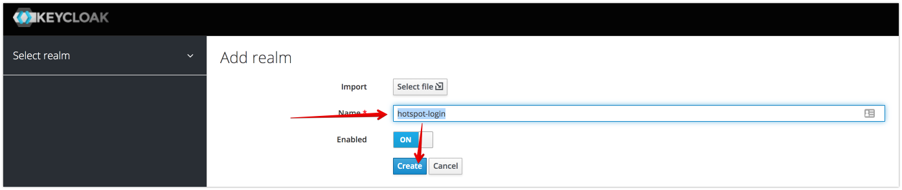
2. create Radius Client 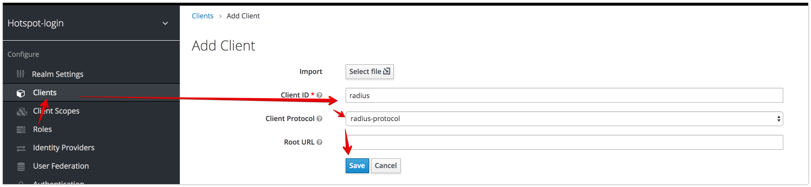
3. create OpenId client 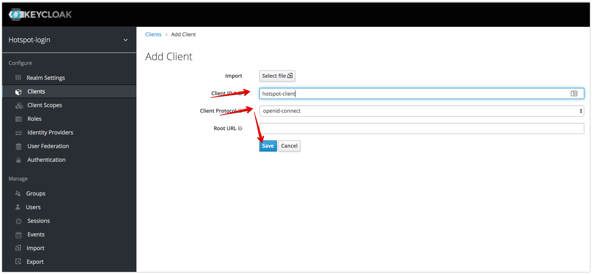
4. Setting your Hotspot DNS in "Valid Redirect URIs" and "Web Origins" 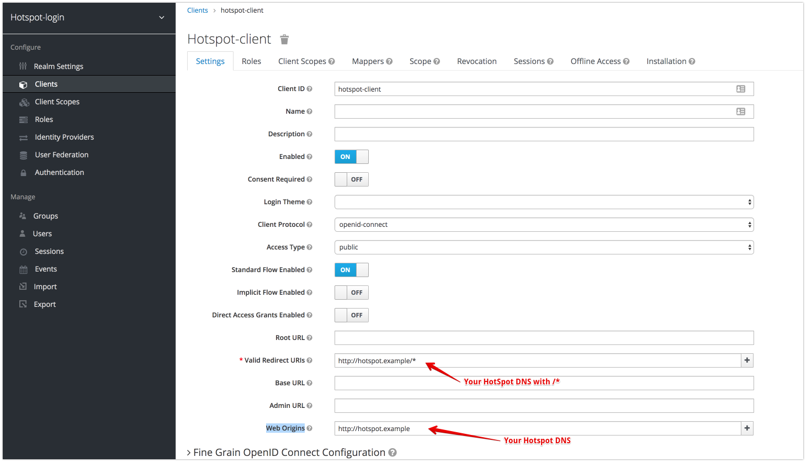
5. add "Radius Session Password" Mapper  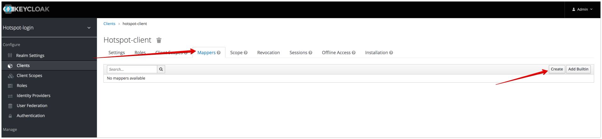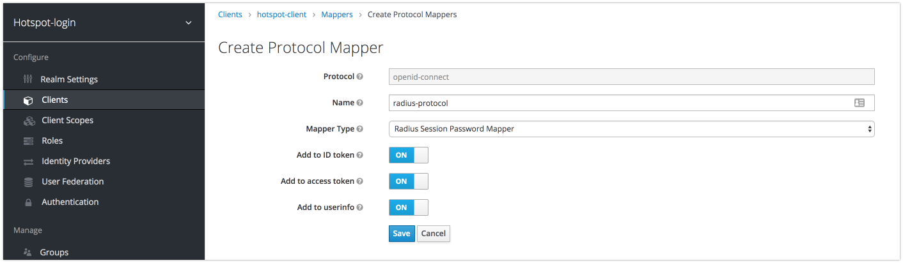
6. Download keycloak.json 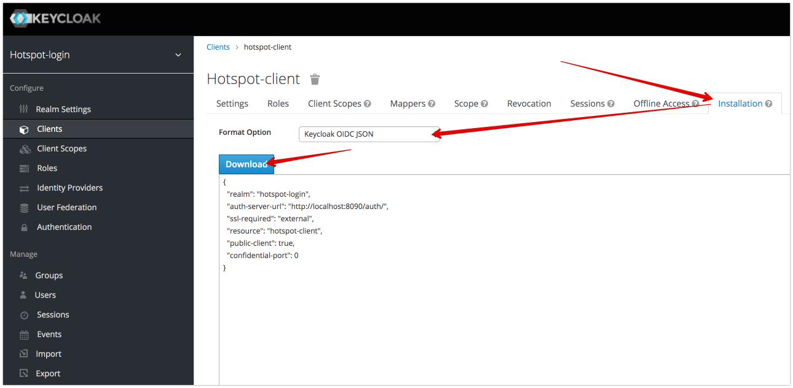

##  Setup Mikrotik
1. Upload all files from [hotspot/mikrotik](mikrotik) to flash/hotspot on device ([authorization.js](mikrotik/authorization.js) and [login.html](mikrotik/login.html))
-  Using web UI
-  Using scp
- Using ftp
- Using winbox
2. Download keycloak.json 
3. upload keycloak.json into flash/hotspot on device
4. update Walled Garden. Add your keycloak host 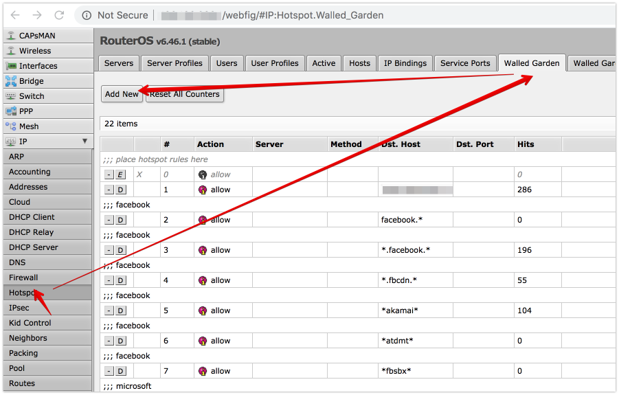 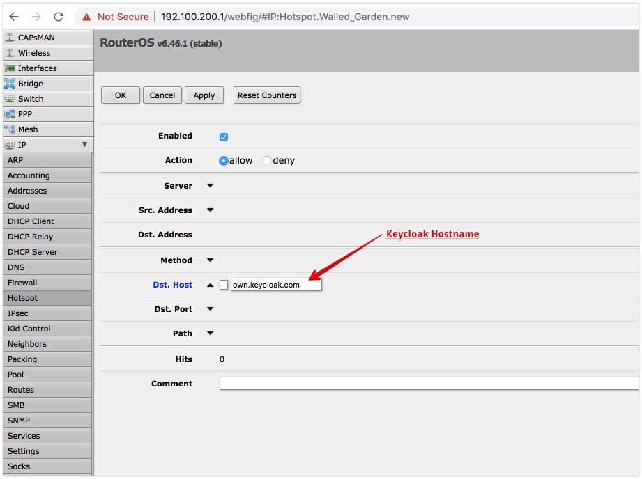

## Facebook Login example
1.  Download Keycloak 8.0.1
2.  install [ngrok](https://ngrok.com/). Register ngrok  <pre><code>./ngrok authtoken \<YOUR TOKEN\></pre></code>
3.  [Configure Keycloak](../README.md#configure-keycloak)
4.  [Start Keycloak](../README.md#run-keycloak-locally)
5. start ngrok <pre><code>./ngrok http 8090</pre></code>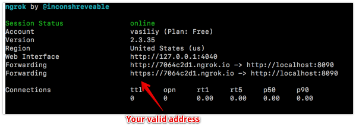
6. open keycloak goto realm and add Facebook Identity Provider 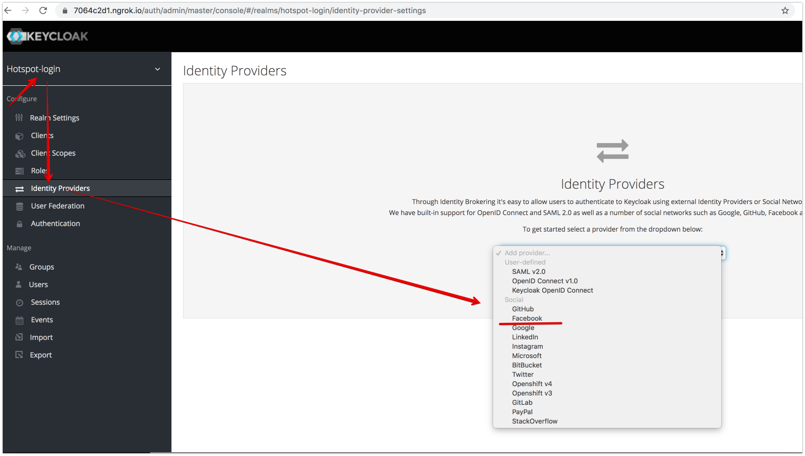
7. Copy Redirect URI 
8. goto [https://developers.facebook.com/](https://developers.facebook.com/) and create a new application 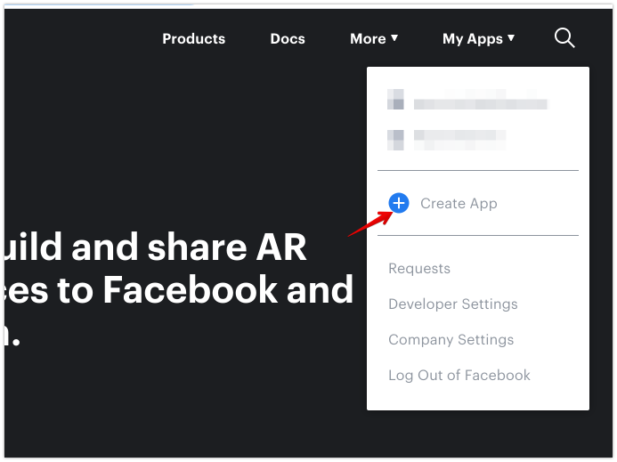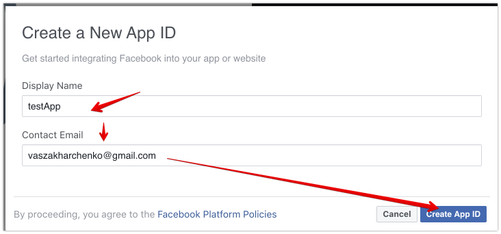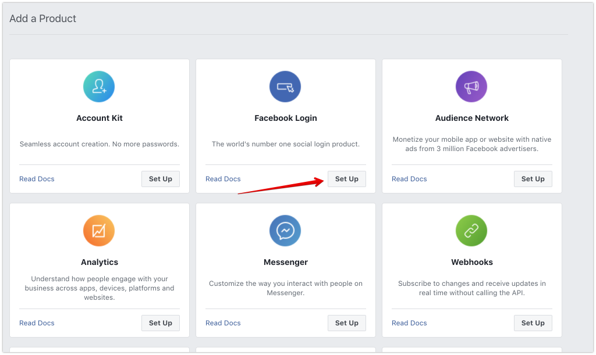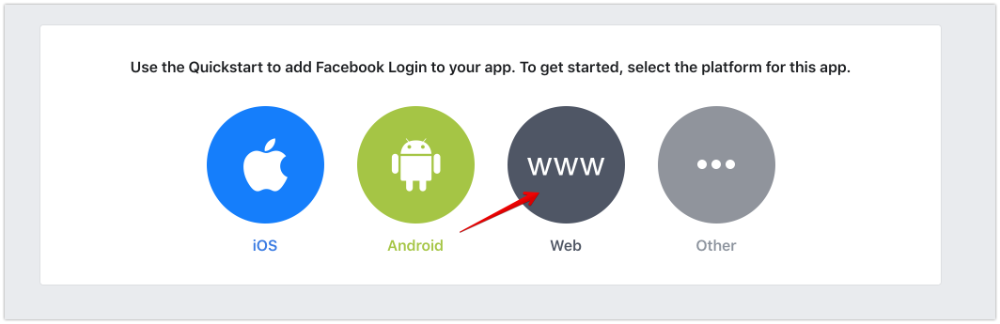
9. Insert Redirect URI from [Step 7](#L43) 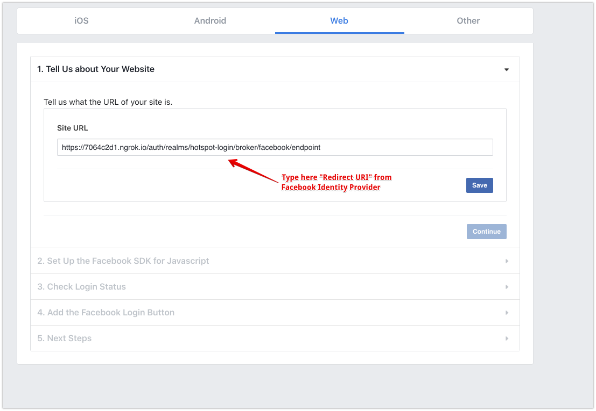
10. Get App Id and Secret from application (Settings->basic) 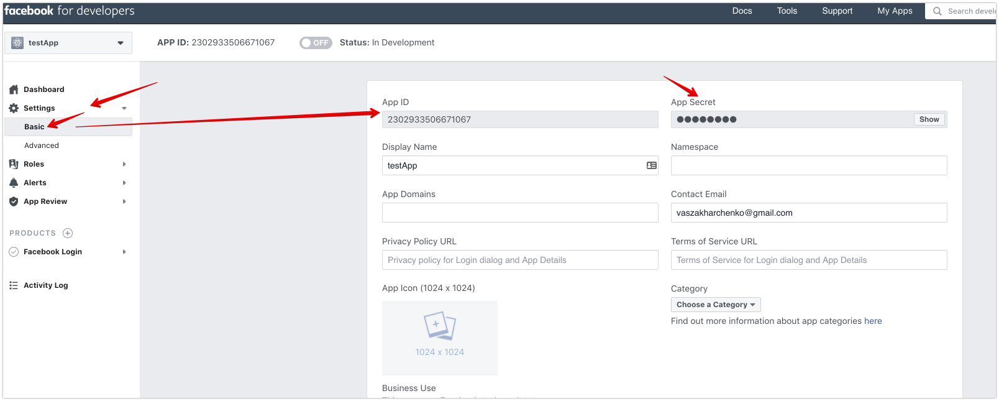
11. back to Keycloak and set this App Id and Secret 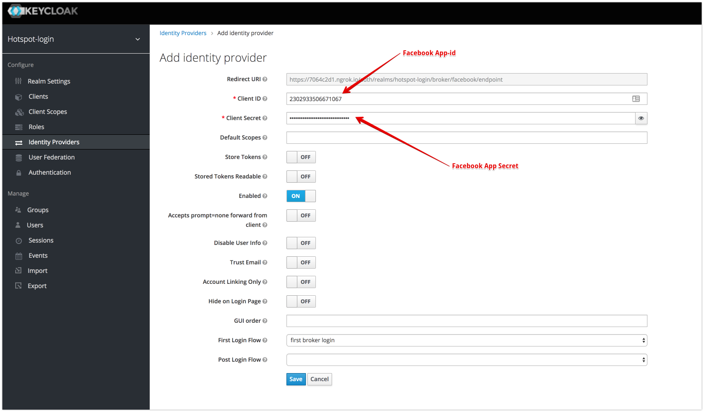
12. add facebook hosts to Walled Garden 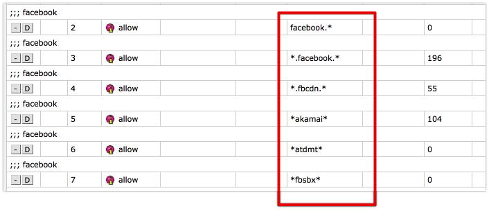
<pre><code>/ip hotspot walled-garden
add comment=facebook dst-host=facebook.*
add comment=facebook dst-host=*.facebook.*
add comment=facebook dst-host=*.fbcdn.*
add comment=facebook dst-host=*akamai*
add comment=facebook dst-host=*atdmt*
add comment=facebook dst-host=*fbsbx*
add comment=common dst-host=www.google-analytics.com
</pre></code>

13. open hotspot page 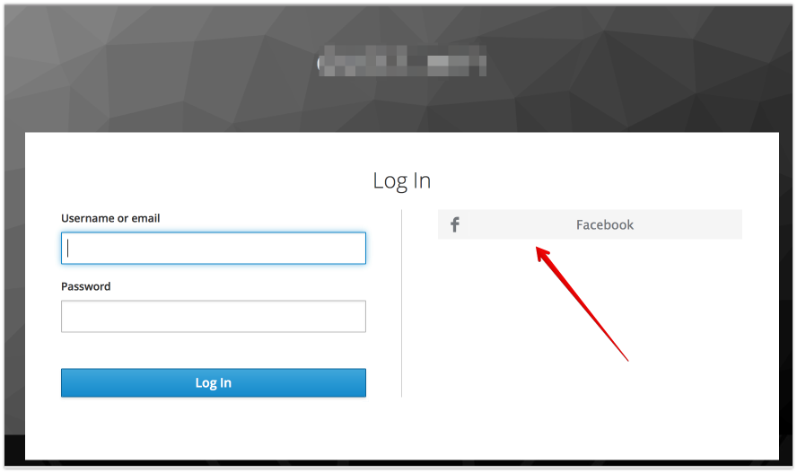 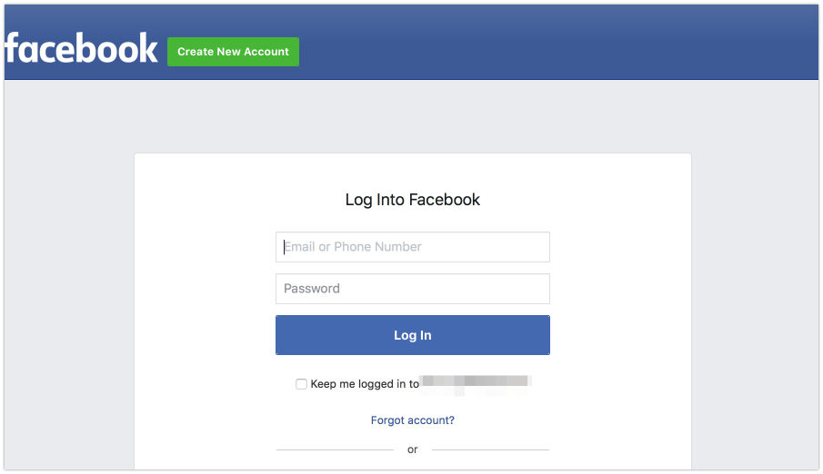

## build UI

### build UI Requirements:
node and npm must be installed  
macbook instalation [brew](https://brew.sh/) : *brew install node*  
[Install node on ubuntu ](https://linuxize.com/post/how-to-install-node-js-on-ubuntu-18.04/)

### Building steps
1. cd hotsot_ui
2. npm i
3. npm run build  
result in [./hotspot](../hotspot)

