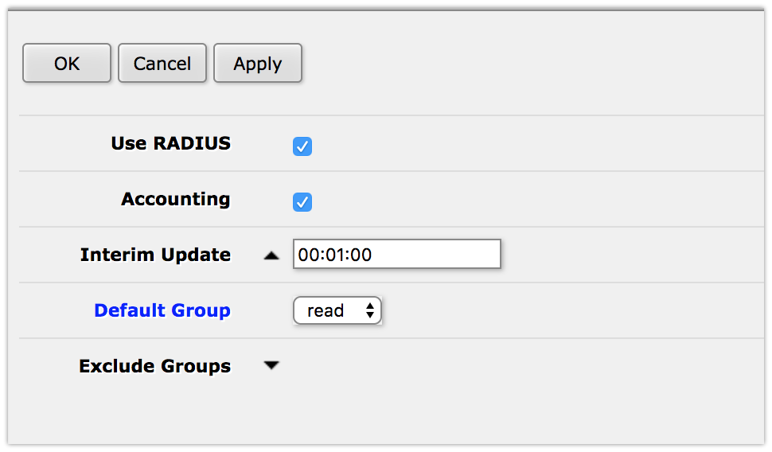

# Mikrotik Keycloak Radius Plugin
 - Mikrotik implementation for Keycloak Radius Plugin
features:
- [Hotspot](../../hotspot/OAuthRadius.md) :
  - pap,chap,mschapv2 authorization
  - [openID connect](../../hotspot/OAuthRadius.md#how-keycloak-radius-hotspot-works)
  - login using [facebook](../../hotspot/OAuthRadius.md#facebook-login-example) , google, etc...
- PPP
  - pap,chap, mschapv2 authorization
support services: hotspot, login, ppp

### Mikrotik Login Example (Radius Server)
1. create ${KEYCLOAK_PATH}/config/radius.config
<pre><code>{
  {
   "sharedSecret":"TEST",
   "authPort":1812,
   "accountPort":1813,
   "useUdpRadius":true,
   "radsec":{
      "privateKey":"config/private.key",
      "certificate":"config/public.crt",
      "useRadSec":false
   }
}</code></pre>

2.  create "mikrotik_login" Realm
3. create "radius" client 
4. create role "MIKROTIK-ADMIN" 
5. assign radius attribute "Mikrotik-Group"="full" to Role "MIKROTIK-ADMIN" 
6. create "testUser" User 
7. set Password "test" for User. uncheck "Temporary"  
8. assign Role "MIKROTIK-ADMIN" to "testUser" 
9. set Action "Update Radius Password" (or send this event to user be email) 
10. Impersonate user 
11. Sign-out 
12. Login with testUser:test 
13. Set Radius User Password 
14. open Mikrotik Radius configuration Page 
15. enable Radius AAA  
16. try to login with a new User  
17. try to login by ssh(the same for telnet and winbox) 

### Mikrotik Rad-sec Example

[Mikrotik RadSec Example](../../keycloak-plugins/rad-sec-plugin/README.md)

###  Hotspot Example (with Facebook login)

[Hotspot Example (with Facebook login)](../../hotspot/OAuthRadius.md)

### Example CoA Configuration
[Radius Disconnect Message](../../keycloak-plugins/radius-disconnect-plugin/README.md)

### Radius Proxy

[Radius Proxy Module](../../keycloak-plugins/proxy-radius-plugin/README.md)
