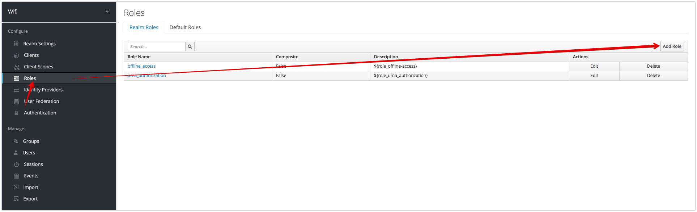
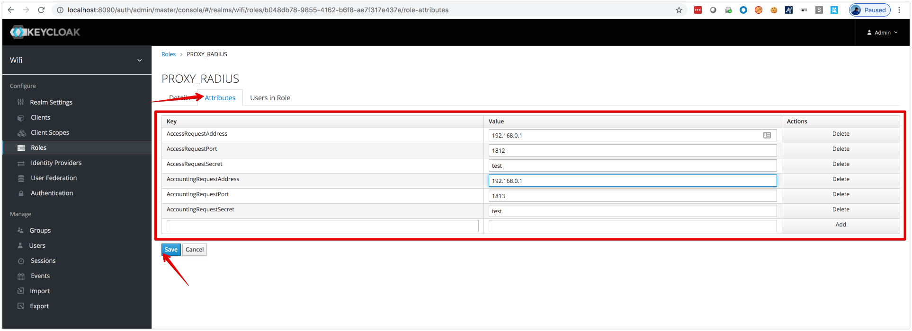
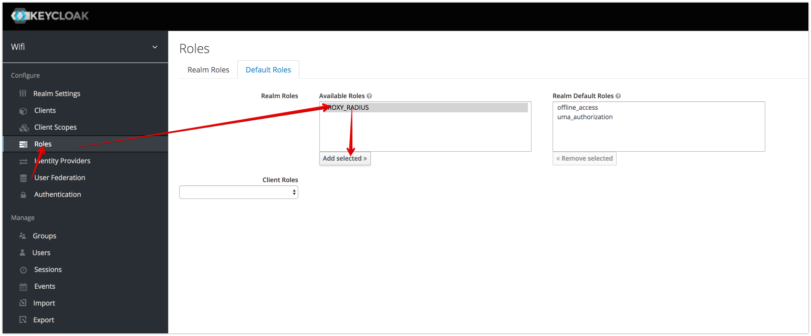
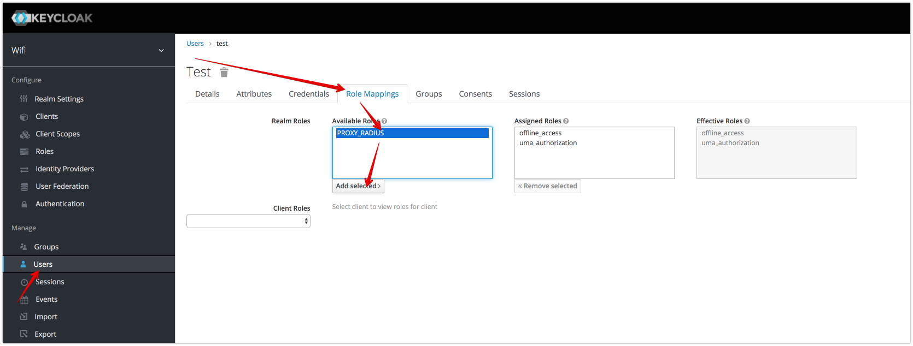
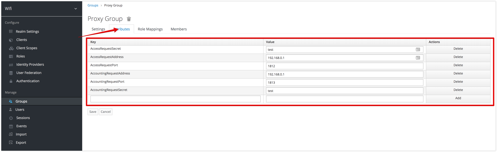

#  Proxy Radius Plugin for Keycloak
- call upper-level radius server

## Create Link to Upper-Level Radius Server
You can add link in 2 way:
- using Role with attributes
- using Group with attributes

## Proxy Attributes
- **AccessRequestAddress** -  Authentication Address
- **AccessRequestPort** - Authentication port (1812)
- **AccessRequestSecret** - Upper-Level Radius shared secret

- **AccountingRequestAddress** -  Accounting Address
- **AccountingRequestPort** - Accounting port (1813)
- **AccountingRequestSecret** - Upper-Level Radius shared secret

### Create Role with upper-Level Radius Server
1. add Role 
2. add attributes to created Role 
3. mark role as default

or assign role to user  

### Create Group with upper-Level Radius Server
1. create 
2. add attributes 
3. assign group to user or create default group
