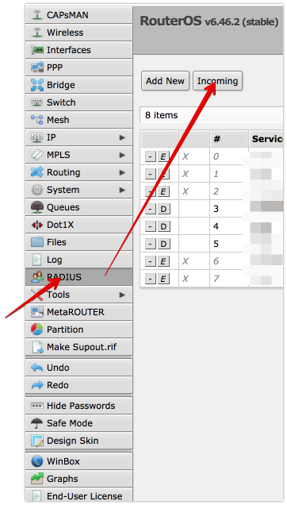
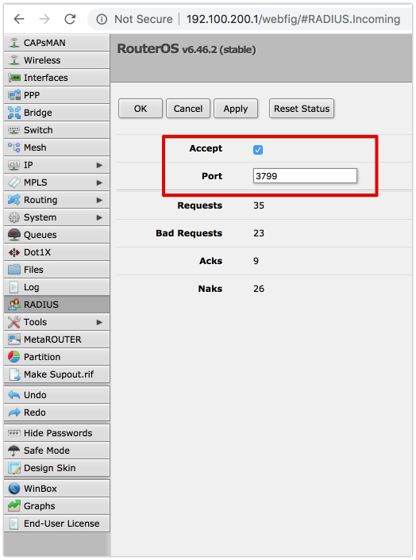
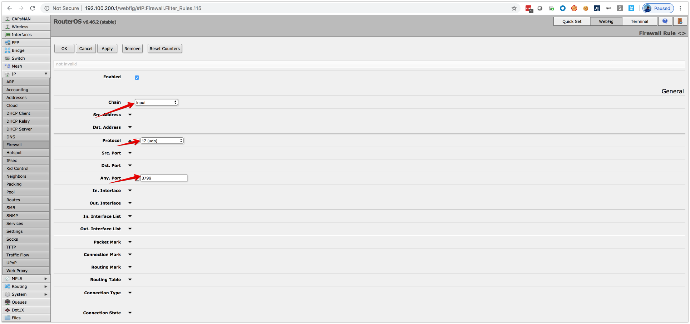
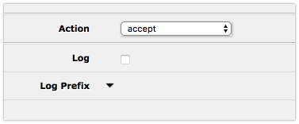

#  CoA Radius Plugin for Keycloak( disconnect-message)
- send disconnect message if the keycloak session has expired
### Mikrotik configuration Example
1. open Radius configuration page and open "Incomming" 
2. 
3. add Firewall Rule  
<pre><code>
/ip firewall filter
add action=accept chain=input port=3799 protocol=udp
</code></pre>

4. activate CoA request on Keycloak side
<pre><code>
{
  "sharedSecret": "radsec",
  "authPort": 1812,
  "accountPort": 1813,
  "numberThreads": 8,
  "useUdpRadius": true,
  "radsec": {
    "privateKey": "config/private.key",
    "certificate": "config/public.crt",
    "numberThreads": 8,
    "useRadSec": true
  },
   "coa":{
      "port":3799,
      "useCoA":true
   }
}
</code></pre>
5. 
